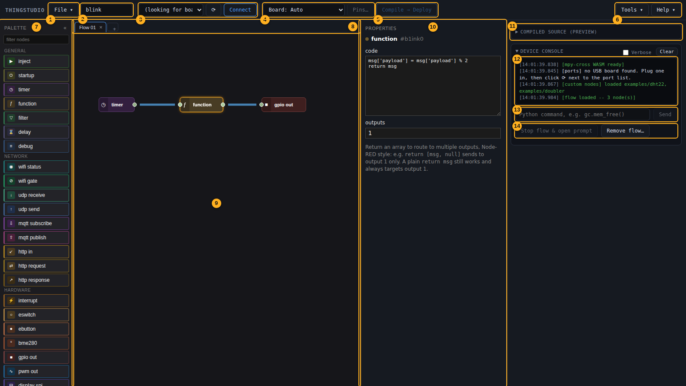

# Canvas basics

## The editor

<figure markdown="span">
  <figcaption>The parts of the editor. Click to see it full size.</figcaption>
</figure>

<!-- These numbers match EDITOR_PARTS in tools/screenshots.py, which draws them. Change both together. -->

1. **File menu:** start a new flow, open one, or save it.
2. **Flow name:** saved with the flow. The board reports it, so you can tell what it's running.
3. **Port list and Connect:** pick your board's port and connect to it. **⟳** looks for boards again.
4. **Board menu and Pins…:** the board the flow is for, and a page of its pins.
5. **Compile → Deploy:** turns the flow into MicroPython and sends it to the board.
6. **Tools and Help:** occasional board jobs, such as installing the runtime, and these docs.
7. **Palette:** every node you can add. Drag one onto the canvas.
8. **Flow tabs:** a flow can be spread across several tabs.
9. **Canvas:** where you build the flow.
10. **Properties:** the selected node's settings.
11. **Compiled source:** the MicroPython made from your flow. Click to open it.
12. **Console:** messages from Thingstudio and the board, including your flow's output.
13. **Python prompt:** runs a line of Python on the board.
14. **Board buttons:** stop the flow and use MicroPython's own prompt, or remove the saved flow.

## Palette

The left sidebar lists every node type you can drag onto the canvas, grouped the same three ways as this guide's [node reference](nodes/index.md): **General**, **Network**, **Hardware**. Custom nodes from `~/.thingstudio/custom-nodes/` (see [Writing custom nodes](custom-nodes.md)) appear under the group their package names, and **Reload custom nodes** at the bottom reads that folder again.

Drag a node onto the canvas, or click it to add it at a default position. Filter the list by typing in the search box above it.

## Wiring

Drag from one node's output port to another's input to connect them. Every port has a type — `int`, `number`, `bool`, `string`, `bytes`, or `any`.

The editor refuses a connection that doesn't make sense: a `bool` input accepts a wire from anything (Python's `bool()` never fails), and a `number` input accepts an `int` (safe widening) but not the other way around. An `any` output can't connect straight into a concrete typed input without an explicit conversion in between. A refused connection is the editor catching a real mismatch, not a bug.

An input can take any number of wires — connect several outputs to the same input and the node fires once per incoming message, whichever one arrives. An output can already fan out to several inputs the same way.

## Property panel

Select a node to see its property panel on the right — every configurable field for that node type. Properties are read when you Compile → Deploy; nothing needs a redeploy just to preview a change.

### Giving a node a flow label

Every node has a **flow label** field at the top of its property panel. Type something (say `Fire!`) and the node
shows it on the canvas instead of its kind (`gui_button`). Blank puts the kind back. Messages and errors that name
the node use it too. It exists only in the editor; it is never sent to the board.

A button also has a **board label**, the text drawn on the button itself. Leave it blank and the button uses the
flow label, so one label is usually enough.

## Presets

Some node types (currently `display_spi` and `display_i2c` — the ones complex enough to be worth naming a
setup) have a **preset** picker at the top of their property panel: a dropdown of saved presets, a save
button, and a refresh button.

Presets are a snapshot, not a live link. Saving one copies that node's current property values under a name
you choose; loading one copies those saved values back onto the node's properties, once, right then. Nothing
stays linked to the preset afterward — editing a field, or editing the saved preset file later, doesn't
change anything already applied. This is deliberate: unlike a WiFi/MQTT credential (see "Config nodes"
below), a preset holds no secret, so there's no reason to keep it out of a flow file you save or commit —
applying one just fills in real values, the same as typing them in yourself.

Presets are saved on the backend as plain JSON files, one per name, under
`~/.thingstudio/presets/<node type>/`, meant to be hand-edited if you'd rather write one directly than build
it by hand in the panel — a good way to keep, say, one file per real display panel you own. A preset file
that doesn't parse as valid JSON shows up in the dropdown disabled, with a warning naming which file is
broken and where to find it, rather than failing silently or applying garbage.

Presets need a backend connection, same as saved credentials — the direct/WebSerial-only connection mode
doesn't support them.

## Config nodes

Some properties are shared across multiple nodes rather than typed into each one separately — WiFi credentials and MQTT broker details. These live in **config nodes**: a WiFi config (a saved credential, plus a security mode — password, open, or [unmanaged](wifi-provisioning.md)) and an MQTT broker config (a saved credential holding host, port, and optional username/password). Reference one from a node's property panel instead of retyping the same SSID into five different nodes.

**The real secret values live in a saved credential, not in the config node or the flow file.** A config node's own credential field is a dropdown of your saved credentials, plus a pencil icon to edit one and a "+" to save a new one — pick an existing WiFi network or MQTT broker, or create one on the spot. Credentials are saved by name on the backend (not in the flow file), so a flow you commit to git never has a real SSID or password in it, and picking the same saved credential from two different flows reuses the one value — editing it in one place updates every flow that references it. This needs a backend connection; the direct/WebSerial-only connection mode doesn't support saved credentials.

**A flow has one WiFi network.** Every node that uses WiFi has a **WiFi** field, and they all show the same setting. Set it on any of them and it changes for all. A board has one radio, so this is one shared setting, not one per node. A flow doesn't need a `wifi_status` node just to use the network.

## Node status

`wifi_status`, `mqtt_publish`, and `mqtt_subscribe` show a small colored dot and a line of text below the node while connected to a device — green for connected, amber for connecting, red for error, grey for disconnected. This reflects what the device is actually doing right now (a real push from the running flow), not the editor's own guess — it only appears once you're connected and the device has reported at least once, and it resets to nothing on every redeploy until the new flow reports its own state.

Other node types don't show this yet — it's currently limited to connection-oriented nodes; `http_request` doesn't get one since it isn't a persistent connection.

## Deleting

Click a node or a wire to select it, then press Delete or Backspace to remove it. Ctrl-click to select several nodes at once and delete them together. Deleting a node also removes any wires attached to it.

## Current limitations

- **No resizable panes**, beyond collapsing the palette and property panel to a thin rail.
