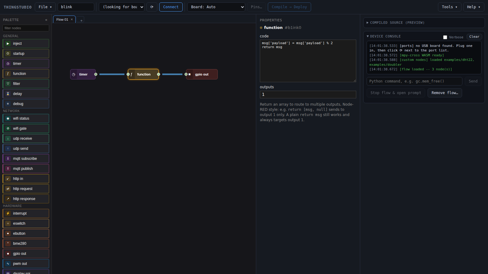

# Thingstudio

Thingstudio is a visual way to program microcontrollers. You build a program in your web browser from blocks, each
doing one job: wait a second, read a sensor, switch a pin. You join the blocks with wires, and data flows along the
wires from one block to the next. The style comes from [Node-RED](https://nodered.org/). Thingstudio turns the result
into [MicroPython](https://micropython.org/), a version of Python for microcontrollers, and sends it to your board. The
board then runs the program you just built. It keeps running it on its own, with no computer attached.

<figure markdown="span">
  [](images/editor.png)<figcaption>The editor: nodes to drag in on the left, your flow in the middle, and on the right the selected
  node's settings and the board's console. Click to see it full size. [Canvas basics](canvas-basics.md#the-editor) labels every
  part.</figcaption>
</figure>

Everything runs on your own computer and your own boards. Thingstudio isn't a cloud service.

- **No account.** There's nothing to sign up for, and nothing is sent to us.
- **Works offline.** Once installed, it needs no internet connection, docs included.
- **Your files, in git.** Thingstudio's files, your programs and your board definitions, are plain, indented
  JSON that you save where you like. They diff cleanly and sit happily in a git repository. Passwords and
  other credentials are stored separately, so a committed program holds no secrets.
- **Made to be extended.** Write your own [custom nodes](custom-nodes.md), and add your own
  [boards](boards.md#adding-a-board) and [processors](boards.md#adding-a-processor). You drop their files into
  a folder. There's nothing to rebuild.
- **Free and open source.** Thingstudio is under the
  [Apache 2.0 licence](https://github.com/mkarliner/ThingStudio/blob/main/LICENSE). You can use it, change it and
  build on it, including in commercial products.

!!! tip "Already know the background?"
    If you know Node-RED, MicroPython or Arduino, skip to what's different for you:
    [Node-RED](coming-from/node-red.md), [MicroPython](coming-from/micropython.md) or
    [Arduino and C](coming-from/arduino.md). Or go straight to [Getting started](getting-started.md).

## What's different about programming with Thingstudio?

Most microcontroller programs are one big loop. Read the sensors, check the buttons, update the outputs, go round
again. It works, but every new job makes the loop longer and its timing harder to reason about.

Thingstudio programs respond to events instead. When the button is pressed, turn on the light. Every ten seconds,
read the temperature. When a message arrives from the network, update the display. Nothing runs until something
happens, and the board can wait for many events at once. This is
[event-driven programming](background/event-driven.md).

Event-driven code can be tricky to write and to follow. The program no longer reads top to bottom, and you have to
manage tasks, callbacks and the code that ties them together. Thingstudio makes this easier. You draw each event
and what should happen next, and Thingstudio writes the code that runs them all side by side.

## Events, nodes and wires

Each block is called a **node**. Each response to an event is drawn as a small chain of nodes. A node does one job: fire every second, read a
pin, run some Python, switch an output. **Wires** join one node's output to the next node's input. Together they make a **flow**.

Nodes pass **messages** along the wires. A message is a small bundle of data, with the main value in its
`payload`. A timer sends a message, a function node changes its payload, and a pin output node acts on it. More on
this in [flows, nodes and messages](background/flows-and-nodes.md).

This way of working comes from [Node-RED](background/node-red.md), a popular tool for home automation and IoT. In
Node-RED, flows run on a server or a Raspberry Pi. In Thingstudio, they run on the microcontroller.

## Running on the board

The board runs [MicroPython](background/micropython.md), a version of Python 3 made for microcontrollers. You install
it once, then Thingstudio adds a small runtime of its own on top.

Thingstudio's events rest on MicroPython's
[`asyncio`](https://docs.micropython.org/en/latest/library/asyncio.html) module, its built-in support for
event-driven programming. `asyncio` lets one program wait for many things at once: timers, pins and the network.
Every flow you build runs as `asyncio` tasks.

When you click **Deploy**, the editor turns your flow into MicroPython code and compiles it. It sends the result to
the board over USB or WiFi, and the board swaps it in and starts running it. There's no firmware to flash, so
changing a flow and trying it again takes seconds. The board keeps the flow and runs it again after a restart.

## Where your own code goes

Nodes cover the common jobs: timers, pins, displays, sensors, WiFi, MQTT, HTTP. For anything else there's the
**function** node, which runs a few lines of your own Python on each message:

```python
msg['payload'] = msg['payload'] * 1.8 + 32
return msg
```

When you find yourself writing the same function node twice, you can make it a node of its own. See
[writing custom nodes](custom-nodes.md). And you can still reach the board's Python prompt from the editor at any
time.

## What you need

- A board with an ESP32-family or RP2040/RP2350 chip. See [boards and processors](boards.md). Other MicroPython
  boards should work too, but we can't test everything. See
  [other microcontrollers](installing-micropython.md#other-microcontrollers).
- A USB cable that carries data, not just power.
- Some knowledge of Python, enough to write a few lines.
- Some knowledge of electronics, enough to wire up an LED.

## Next

[Getting started](getting-started.md) lists the steps from a new board to a blinking LED, and starts you on the
first one.

These docs follow the latest code. The copy inside Thingstudio (**Help → User guide**) matches the version you have
installed.
